


 

<b>Computer vision and ML engineer.</b> I train the model, compile it down to something a robot can run at 30ms, and ship the pipeline around it — segmentation on SageMaker, YOLOv11 on a Jetson, multimodal LLMs across a GPU cluster.

 

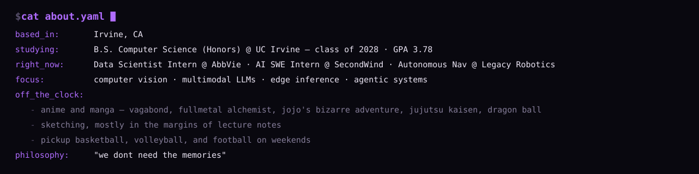

 

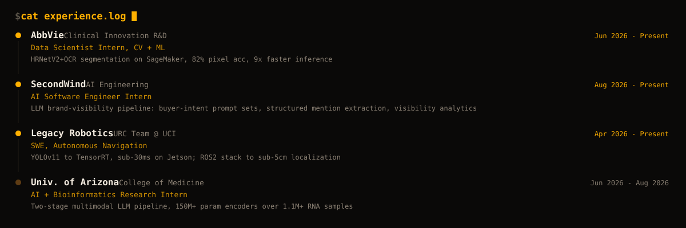

 

<a href="https://github.com/har-m33t/NIMBUS">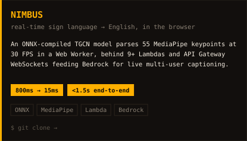</a>
<a href="https://github.com/har-m33t/VIPER">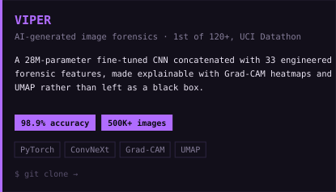</a>
<a href="https://github.com/har-m33t/six_eyes_drone_intelligence_platform">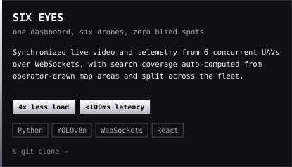</a>
<a href="https://github.com/har-m33t/URC-2026">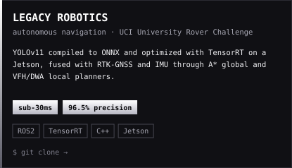</a>

 


 


 

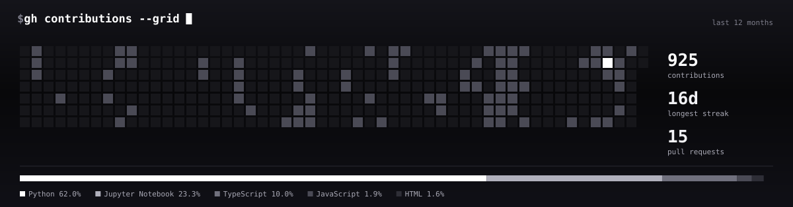

<picture>
  <source media="(prefers-color-scheme: dark)" srcset="https://raw.githubusercontent.com/har-m33t/har-m33t/output/github-contribution-grid-snake-dark.svg"/>
  <source media="(prefers-color-scheme: light)" srcset="https://raw.githubusercontent.com/har-m33t/har-m33t/output/github-contribution-grid-snake.svg"/>
  
</picture>

 

<a href="https://harmeet-singh.dev">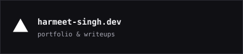</a>
<a href="mailto:harmeets130922@gmail.com">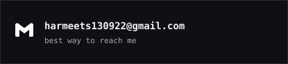</a>
<a href="https://linkedin.com/in/harmeet-singh-uppal">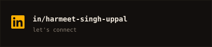</a>
<a href="https://github.com/har-m33t">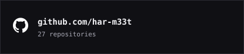</a>

 
<code>harmeet@github:~$ █</code>

